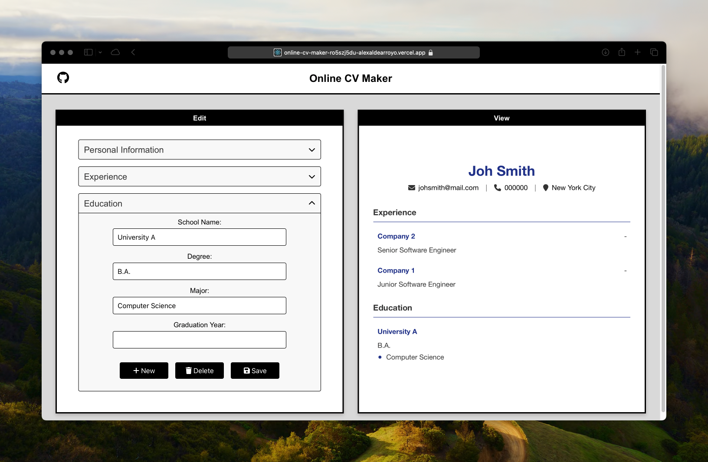

# Online CV Maker

## Overview

Online CV Maker is a web application designed to create professional and customizable resumes online. It provides a user-friendly interface where users can input their personal information, educational background, work experience, and other relevant details. The app offers a live preview feature, allowing users to see how their resume looks as they fill out the form.

Check it out here: https://online-cv-maker.vercel.app

## Features

- **Personal Information Form**: Enter your full name, email, phone number, and location.
- **Experience Form**: Add and edit your professional experiences, including company name, role, start and end dates, and a description of your responsibilities and achievements.
- **Education Form**: Include your educational background, with details about the institution, degree, major, and graduation year.
- **Live Resume Preview**: See how your resume looks in real time as you input your data.

## Technologies Used

- React.js
- FontAwesome for icons
- Local Storage for saving user data

